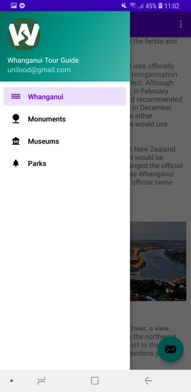
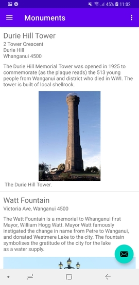
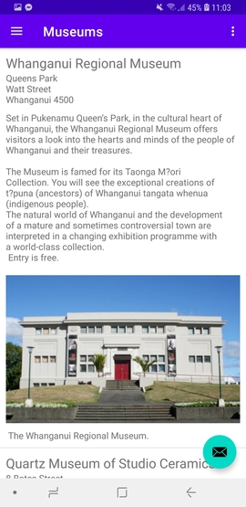

# TourProjectApp
Android Basics: Multiscreen App(ud839) - Project

## Project Overview
This is the final project for Android Basics: Multiscreen App(ud839) section of the Nanodegree program. 
Making your own multi-screen Android app to share your knowledge about a city you are very familiar with.

The goal is to create a tour guide app which presents relevant information to a user who’s visiting your city. 
The app can lists Monuments, Parks, Museums, and general information about Whanganui. 

## Why this project?
To practice  skillset by presenting information that you care about in your own life to a user. 
Your Tour Guide app will be unique to your city, your life, and your interests.

## What will I learn?
This project is about combining various ideas and skills we’ve been practicing throughout the course. They include:

Planning your app design and navigation before coding.
Selecting proper data structures to store lists of information.
Building layouts to display those lists of data.
Navigating between those lists using intents and multiple Activities or a ViewPager.
Creating your own custom classes.
Properly handling images or audio (if applicable).
Note: As the focus of this program is Java, only projects completed with Java as the source code will be accepted. Projects using Kotlin as the source code will not be accepted.
<table>
<tr>
<td>
  
Main Screen
</td>
<td>

Menu
</td>
</tr>
<tr>
<td>

Monuments
</td>
<td>

Museums
</td></tr></table>